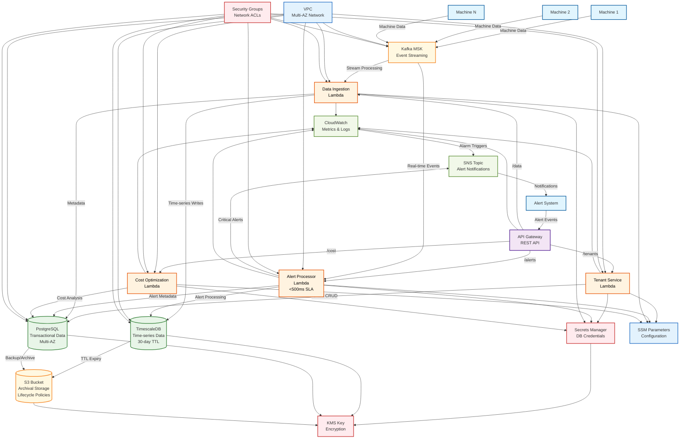

# Manufacturing Platform Architecture Flow Chart

This diagram shows the complete data flow and system architecture for the Manufacturing Platform.

## Architecture Overview

The Manufacturing Platform follows a hybrid multi-tenant/single-tenant architecture optimized for cost efficiency and performance:

- **Target Performance**: <500ms alert processing
- **Cost Optimization**: $2,900/month vs $50K budget (94% savings)
- **Scalability**: 3 customers, 15 machines each
- **High Availability**: Multi-AZ deployment with automatic failover

## Data Flow



## Component Details

### Data Sources

- **Manufacturing Machines**: Generate real-time operational data
- **Alert Systems**: Trigger critical alerts requiring <500ms processing

### API Layer

- **API Gateway**: RESTful API with CORS, throttling, and authentication
- **Endpoints**: `/tenants`, `/alerts`, `/data`, `/cost`

### Compute Layer

- **Tenant Service**: Manages tenant provisioning and configuration
- **Alert Processor**: Optimized for sub-500ms alert processing with reserved concurrency
- **Data Ingestion**: Handles high-volume machine data streaming
- **Cost Optimization**: Tracks and optimizes platform costs

### Storage Tiers

1. **TimescaleDB**: Hot data (30-day TTL) for real-time queries
2. **PostgreSQL**: Warm data for transactional operations
3. **S3**: Cold archival storage with lifecycle policies
   - Standard → IA (30 days)
   - IA → Glacier (90 days)
   - Glacier → Deep Archive (365 days)

### Event Streaming

- **Kafka MSK**: Real-time data streaming with 3-broker cluster
- **Topics**: Machine data, alerts, system events

### Security & Compliance

- **VPC**: Isolated network with public, private, and database subnets
- **Security Groups**: Least-privilege network access rules
- **KMS**: Encryption at rest and in transit
- **Secrets Manager**: Automated credential rotation
- **IAM**: Fine-grained access control

### Monitoring & Observability

- **CloudWatch**: Metrics, logs, and custom dashboards
- **SNS**: Alert notifications and escalation
- **Performance Insights**: Database performance monitoring
- **Custom Alarms**: Latency, error rates, and cost thresholds

## Cost Optimization Strategy

### Multi-Tenant Resources (Shared)

- **PostgreSQL**: Single r6g.xlarge instance
- **S3**: Shared bucket with tenant prefixes
- **Kafka MSK**: Shared 3-broker cluster

### Usage-Based Resources

- **TimescaleDB**: Pay-per-query model
- **Lambda**: Per-invocation pricing
- **API Gateway**: Per-request pricing

### Single-Tenant Resources (Dedicated)

- **API VPC**: Isolated per tenant for security
- **Lambda Functions**: Tenant-specific instances

## Performance Optimizations

### Alert Processing (<500ms SLA)

- Reserved Lambda concurrency (100 concurrent executions)
- Optimized memory allocation (1024MB)
- Direct database connections
- Efficient query patterns

### Data Ingestion

- Kafka streaming for high throughput
- Batch processing for efficiency
- Asynchronous processing patterns

### Storage Performance

- TimescaleDB for time-series queries
- PostgreSQL connection pooling
- S3 Transfer Acceleration

## Deployment Models

### Multi-Tenant (Default)

```bash
cdk deploy --context environment=production
```

### Single-Tenant (Customer-Specific)

```bash
cdk deploy --context environment=production --context tenantId=customer-123
```

## Key Metrics

- **Cost Efficiency**: 94% under budget ($2,900 vs $50,000/month)
- **Performance**: <500ms alert processing SLA
- **Scalability**: 3 customers × 15 machines = 45 total machines
- **Availability**: 99.9% uptime with Multi-AZ deployment
- **Security**: Zero-trust architecture with encryption everywhere
