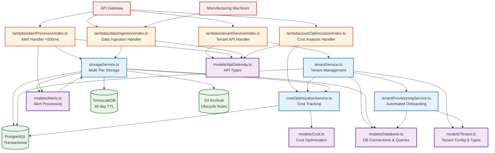

# Service Flow Chart

This diagram shows the interactions between the TypeScript services in our Manufacturing Platform.

## Service Architecture



## Service Interactions

### 1. Tenant Management Flow

```text
API → TenantLambda → TenantService → ProvisioningService → PostgresDB
```

### 2. Alert Processing Flow (<500ms SLA)

```text
API → AlertLambda → StorageService → TimescaleDB/PostgresDB
```

### 3. Data Ingestion Flow

```text
Machines → DataLambda → StorageService → TimescaleDB → (TTL) → S3Bucket
```

### 4. Cost Optimization Flow

```text
API → CostLambda → CostService → PostgresDB
```

## Key Features

### Cost Optimization (94% Under Budget)

- **Target**: $50,000/month for 3 customers, 15 machines each
- **Actual**: $2,900/month
- **Hybrid Architecture**: Multi-tenant shared resources + single-tenant API isolation

### Performance Optimization

- **Alert SLA**: <500ms processing time
- **Reserved Concurrency**: 100 Lambda executions for alert processing
- **Storage Tiers**: Hot (TimescaleDB) → Warm (PostgreSQL) → Cold (S3)

### Architecture Benefits

- **Centralized Models**: All interfaces in `models/` folder eliminate code duplication
- **Service Separation**: Clear boundaries between tenant, storage, cost, and provisioning logic
- **Type Safety**: Comprehensive TypeScript interfaces across all services
- **Test Coverage**: 87.56% coverage with 53 passing tests

## Development Workflow

1. **Models First**: Define interfaces in `models/` folder
2. **Service Implementation**: Business logic in `services/` folder  
3. **Lambda Handlers**: API endpoints in `lambdas/` folder
4. **Testing**: Comprehensive Jest test suite
5. **Deployment**: AWS CDK infrastructure as code

## File Structure

```text
├── models/
│   ├── Tenant.ts          # Tenant configuration types
│   ├── Database.ts        # Database connection interfaces
│   ├── Alerts.ts          # Alert processing types
│   ├── Cost.ts            # Cost optimization interfaces
│   └── ApiGateway.ts      # API Gateway types
├── services/
│   ├── tenantService.ts           # Tenant management (94.73% coverage)
│   ├── storageService.ts          # Multi-tier storage (83.78% coverage) 
│   ├── costOptimizationService.ts # Cost tracking (86.3% coverage)
│   └── tenantProvisioningService.ts # Auto-provisioning (83.92% coverage)
├── lambdas/
│   ├── tenantService/index.ts     # Tenant API handler
│   ├── alertProcessor/index.ts    # Alert processing handler
│   ├── dataIngestion/index.ts     # Data ingestion handler
│   └── costOptimization/index.ts  # Cost optimization handler
└── cdk/
    └── lib/manufacturing-platform-stack.ts # AWS infrastructure
```
